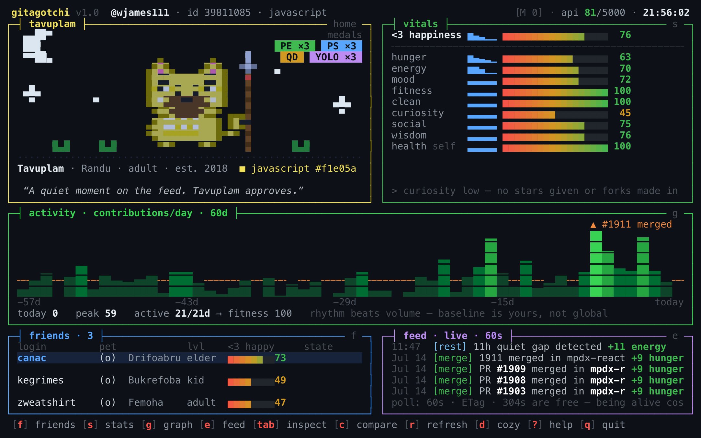
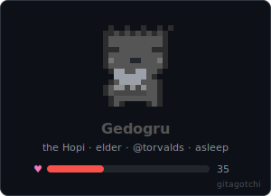
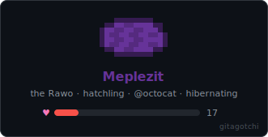

# gitagotchi

**A terminal Tamagotchi whose entire life is derived from your GitHub account.**

Your pet's state is a pure function — `pet_state = f(github_data, wall_clock)`. Nothing is
stored and nothing is sent anywhere: GitHub *is* the database. Delete the cache and the
exact same pet hatches again, on any machine.



Merge a PR and it eats. Rest over the weekend and it sleeps. Give stars, review code, ship
consistently — ten stats, each named to the GitHub signal it reads, feed a single happiness
score with a misery cap. Every account already has a pet; here are a few:

<p align="center">
  
  
  
</p>

Species, name, color, and markings are a pure function of your numeric account id and top
language — so your pet is *yours*, deterministically, forever.

## Install

```sh
brew install wjames111/gitagotchi/gitagotchi     # macOS / Linux
```

Debian/Ubuntu — add the apt repo once, then install (and upgrade) by name:

```sh
sudo install -d /etc/apt/keyrings
curl -fsSL https://wjames111.github.io/gitagotchi/KEY.gpg | sudo tee /etc/apt/keyrings/gitagotchi.asc >/dev/null
echo "deb [signed-by=/etc/apt/keyrings/gitagotchi.asc] https://wjames111.github.io/gitagotchi stable main" \
  | sudo tee /etc/apt/sources.list.d/gitagotchi.list >/dev/null
sudo apt update && sudo apt install gitagotchi
```

Or grab the `.deb` from the [latest release](https://github.com/wjames111/gitagotchi/releases/latest)
and `sudo apt install ./gitagotchi_*_all.deb`. From source: clone and run `gh-pet/gh-pet`
(needs `bash ≥ 4`, `jq`, `curl`).

## Use

```sh
gh-pet                    # your pet (auth via gh CLI, $GITHUB_TOKEN, or public-only)
gh-pet octocat            # anyone's pet, from public data
gh-pet compare torvalds   # side-by-side — friendly rivalry, not a leaderboard
gh-pet badge > pet.svg    # render your pet as an SVG for your profile README
```

The **dense layout** above is the default at every size — five panels, each border colored
to its meaning, sparkline vitals with derived history, a 60-day contribution graph, a
friends table, and a live feed. It compresses to fit; a terminal ≥ 110×32 with truecolor
shows it uncramped, and `d` (or `--cozy`) switches to the minimal single-pet layout.
Plainer terminals fall back through ANSI-256 to a pure-ASCII pet; nothing is required
beyond `bash`, `jq`, `curl`.

## Put your pet in your profile README

`gh-pet badge` emits a self-contained SVG — pixel-perfect, theme-dark, with a CSS blink that
survives GitHub's image proxy. Drop [`templates/pet-badge.yml`](gh-pet/templates/pet-badge.yml)
into your `<login>/<login>` profile repo and it re-renders on an hourly cron (the pet changes
even when GitHub doesn't — hunger decays, sleep follows the clock), committing only when the
pet actually changed:

```markdown

```

## More

- [**Full documentation**](gh-pet/README.md) — every stat and its GitHub source, dense-mode
  panels, the render ladder, keybindings.
- [**Design & architecture**](plan.md) — the pure-function invariant, identity derivation,
  the polling/caching budget, packaging.

*Built with bash, `jq`, and half-block Unicode. MIT licensed.*
